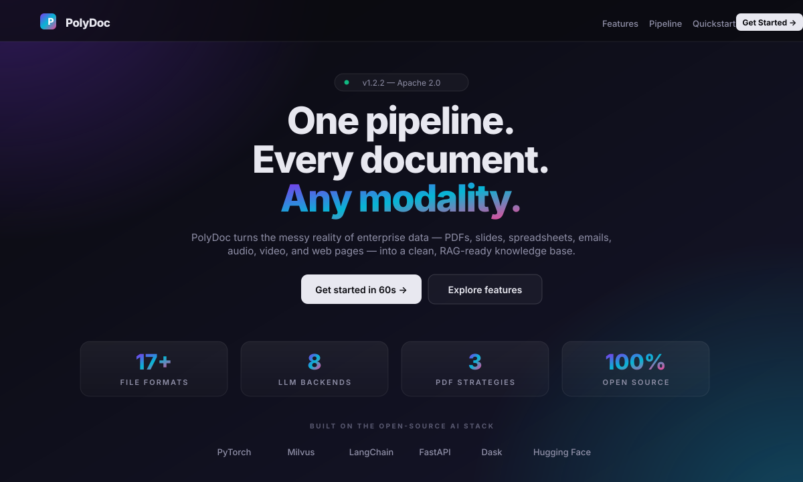
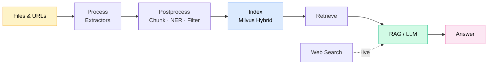

<div align="center">

# PolyDoc

### One pipeline · Every document · Any modality

**PolyDoc** turns the messy reality of enterprise data — PDFs, slides, spreadsheets, emails, audio, video, and web pages — into a clean, searchable, RAG-ready knowledge base.

[](LICENSE)
[](#)
[](#)
[](#)
[](#)

[**Quickstart**](#-quickstart) ·
[**Features**](#-why-polydoc) ·
[**Architecture**](#-architecture) ·
[**Docs**](docs/) ·
[**Examples**](examples/)

</div>

---

<div align="center">

### Preview

<a href="https://yueyili128-stack.github.io/polydoc/">
  
</a>

<p>
  <a href="https://yueyili128-stack.github.io/polydoc/"><b>🌐 Live demo</b></a>
  &nbsp;·&nbsp;
  <a href="docs/landing.html"><b>📄 Local HTML</b></a>
  &nbsp;·&nbsp;
  <a href="docs/landing-preview.svg"><b>🖼 SVG mockup</b></a>
</p>

<sub>↑ Static preview shown above. The live demo runs the full interactive page — animated gradients, hover effects, scroll reveals.</sub>

</div>

---

## Why PolyDoc?

| | |
|---|---|
| **Massively multimodal** | One unified `MultimodalSample` format for text, images, audio, video, tables. |
| **Distributed by default** | Dask + PyTorch multiprocessing — scale across cores or a whole cluster. |
| **Hybrid retrieval** | Dense embeddings, SPLADE sparse, and ColPali visual — combine them all. |
| **Pluggable everything** | Swap LLMs, embedders, vector stores by editing a single YAML field. |
| **Production ready** | FastAPI services, Docker images, full CI, incremental state tracking. |
| **Open source** | Apache 2.0. No vendor lock-in, no API gates, no surprises. |

## Features at a glance

- **17+ file formats** out of the box — PDF, DOCX, PPTX, XLSX, MD, TXT, EML, HTML, MP3/4, WAV, MOV, MKV, AVI, AAC, and more
- **Three-tier PDF strategy** — PyMuPDF fast path, Marker + Surya OCR for layout-heavy docs, ColPali for visual-only retrieval
- **Hybrid vector search** powered by Milvus (dense + SPLADE)
- **Universal LLM backend** — OpenAI, Anthropic, Mistral, Cohere, AWS Bedrock, vLLM, HuggingFace, SwissAI
- **Live web search augmentation** — DuckDuckGo (free) or Tavily (premium)
- **Incremental processing** — state-aware crawler skips already-processed files
- **HTTP Index API** — stream new files into your vector store on the fly

## Architecture



Five orthogonal stages, all driven by YAML, all glued together by a single CLI: `process → postprocess → index → retrieve → rag` (with `websearch` and the `colpali` visual track running in parallel).

## Quickstart

### Option 1 — Docker (fastest)

```bash
docker pull ghcr.io/yueyili128-stack/polydoc:edge-gpu   # CUDA 12.6
docker pull ghcr.io/yueyili128-stack/polydoc:edge-cpu   # CPU only
```

### Option 2 — Pip / uv

System dependencies first (Linux):

```bash
sudo apt update
sudo apt install -y ffmpeg libsm6 libxext6 libnss3 libreoffice \
  libpango-1.0-0 libpangoft2-1.0-0 weasyprint
```

Then install only the slices you need:

```bash
# Full install — CPU
uv pip install "polydoc[all,cpu]"

# Full install — GPU (CUDA 12.6)
uv pip install "polydoc[all,cu126]"

# Just the processing pipeline
uv pip install "polydoc[process,cpu]"
```

> Tip — PolyDoc has heavy ML deps. We strongly recommend [`uv`](https://github.com/astral-sh/uv) over plain `pip`.

### Run the pipeline

```bash
# 1. Process files
polydoc process --config-file examples/process/config.yaml

# 2. Postprocess — chunk, clean, tag, NER
polydoc postprocess -c examples/postprocessor/config.yaml \
                    -i examples/process/outputs/merged/merged_results.jsonl

# 3. Build the hybrid index
polydoc index -c examples/index/config.yaml \
              -f examples/postprocessor/outputs/merged/results.jsonl

# 4. Ask questions
polydoc rag --config-file examples/rag/config.yaml
```

### Or use it as a library

```python
from polydoc.process.processors.pdf_processor import PDFProcessor
from polydoc.process.processors.base import ProcessorConfig
from polydoc.type import MultimodalSample

cfg = ProcessorConfig(custom_config={"output_path": "outputs"})
processor = PDFProcessor(config=cfg)
results = processor.process_batch(
    ["/path/to/file.pdf"],
    use_fast=False,
    num_workers=1,
)
MultimodalSample.to_jsonl("out.jsonl", results)
```

## Install slices

Mix and match — install only what your workload needs.

| Extra | What it includes |
|---|---|
| `process` | Document extraction + postprocessing |
| `index` | Vector store + embeddings (Milvus, SPLADE, sentence-transformers) |
| `rag` | Retrieval-Augmented Generation (LangChain, ragas) — includes `index` |
| `api` | FastAPI servers + MongoDB drivers |
| `websearch` | DuckDuckGo + optional Tavily |
| `cpu` | PyTorch CPU build |
| `cu126` | PyTorch CUDA 12.6 build |
| `all` | Everything above |

## Supported file types

| Category | Formats | Device | Fast mode |
|---|---|---|---|
| **Text documents** | DOCX, MD, PPTX, XLSX, TXT, EML | CPU | — |
| **PDFs** | PDF | CPU / GPU | yes |
| **Media** | MP4, MOV, AVI, MKV, MP3, WAV, AAC | CPU / GPU | yes |
| **Web** | HTML, URLs | CPU | — |

## Pipeline stages

| Stage | What it does | Docs |
|---|---|---|
| **Process** | Extract text, metadata, and media from any input. New format? Drop in a `Processor` subclass. | [process.md](docs/process.md) |
| **Index** | Build a hybrid Milvus index — dense + sparse, local lite or remote standalone. Live HTTP API available. | [index.md](docs/index.md) · [index_api.md](docs/index_api.md) |
| **RAG** | LangChain pipeline — plug any LLM, retriever, prompt template. Run as CLI, batch, or API. | [rag.md](docs/rag.md) |
| **Web search** | Iterative sub-query loop over DuckDuckGo or Tavily, fused into the RAG context. | [websearch.md](docs/websearch.md) |
| **ColPali** | Page-level visual retrieval for layout-heavy PDFs — bypasses OCR entirely. | [colpali.md](docs/colpali.md) |
| **Evaluation** | RAG quality scoring with ragas — coming soon. | [evaluation.md](docs/evaluation.md) |

## Documentation

| | | |
|---|---|---|
| [Installation](docs/installation.md) | [Process](docs/process.md) | [Index](docs/index.md) |
| [Index API](docs/index_api.md) | [RAG](docs/rag.md) | [Web Search](docs/websearch.md) |
| [ColPali](docs/colpali.md) | [Evaluation](docs/evaluation.md) | [Profiler](docs/profiler.md) |
| [Distributed processing](docs/distributed_processing.md) | [Production deployment](docs/rcp_and_production.md) | [Contributor guide](docs/for_devs.md) |

## Contributing

We love contributions. See [`docs/for_devs.md`](docs/for_devs.md) for environment setup, code style (`ruff`), and the test suite.

## License

Apache 2.0 — see [LICENSE](LICENSE).
